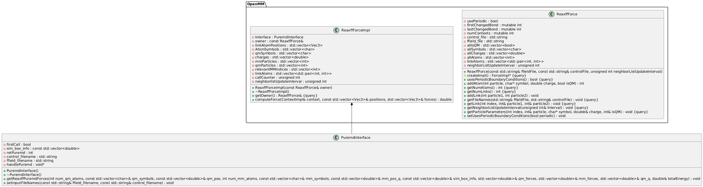

# OpenMM ReaxFF Plugin

This repository provides an OpenMM plugin for ReaxFF-based force fields. It exposes a ReaxFF force implementation within the OpenMM ecosystem and integrates the underlying ReaxFF PuReMD code through the bundled PureMD/sPuReMD implementation in [3rdParty/sPuReMD](3rdParty/sPuReMD).

## What this plugin provides

- A native OpenMM force implementation for ReaxFF simulations
- Python bindings for use with the OpenMM Python stack
- Integration with the bundled ReaxFF-PuReMD/sPuReMD engine for force evaluation
- Support for QM/MM-style workflows with link atoms
- Parallelization support through the plugin code paths, with the underlying ReaxFF implementation also being MPI-capable

## Project structure

- [openmmapi](openmmapi): OpenMM-facing API and implementation
- [source](source): core source files for the plugin
- [python](python): Python wrapper and SWIG interface
- [tests](tests): regression and smoke tests
- [3rdParty/sPuReMD](3rdParty/sPuReMD): bundled PureMD/sPuReMD implementation used by the plugin

## Dependencies

This plugin is intended to be installed in a conda or mamba environment. The following packages are required:

- OpenMM
- openff-toolkit
- openmmforcefields
- cmake
- swig
- numpy
- alive-progress
- rdkit

## Installation with mamba

Create and activate a dedicated environment:

```bash
mamba create -n openmm-reaxff -c conda-forge \
  python=3.10 openmm openff-toolkit openmmforcefields \
  cmake swig numpy alive-progress rdkit

mamba activate openmm-reaxff
```

Clone the repository and build it from source:

```bash
git clone https://github.com/<your-user>/openmm-reaxff-plugin.git
cd openmm-reaxff-plugin
mkdir build && cd build
cmake .. -DCMAKE_INSTALL_PREFIX=$CONDA_PREFIX -DOPENMM_DIR=$CONDA_PREFIX
cmake --build . --config Release -j$(nproc)
cmake --install .
```

The build above installs the plugin into the active conda environment.

## PureMD/sPuReMD integration

The force engine used by this plugin is based on the bundled ReaxFF-PuReMD implementation under [3rdParty/sPuReMD](3rdParty/sPuReMD). This code is compiled as part of the plugin build and provides the low-level ReaxFF force evaluation routines used by the OpenMM interface.

## MPI and parallelization

The plugin includes parallelization-related directives and the underlying ReaxFF implementation is also compatible with MPI-based execution strategies. This makes it suitable for larger-scale simulations, keeping the passes between OpenMM and PuReMD smooth and fast.

## Class structure
The blow image contains the UML diagram of the Plugin. The classes needed OpenMM OpenMM communicate through the PuremdInterface class with the ReaxFF implementation, which is a purely functional C implementation.



## Python usage

Once installed, the Python wrapper is available for use with OpenMM just like any other custom force. In practice, the plugin is used by importing the OpenMM ReaxFF functionality and constructing a ReaxFF force object for the system of interest.

## Example: hybrid ReaxFF/MM setup

The example in [examples/2_7xf7-protein-and-fragments.ipynb](examples/2_7xf7-protein-and-fragments.ipynb) demonstrates a common hybrid strategy: a selected region of the system is treated with ReaxFF, while the surrounding atoms remain under the standard OpenMM force field.

This is necessary because ReaxFF and classical force fields describe the same chemical interactions in different ways. If the ReaxFF atoms were left with their ordinary bonded and nonbonded terms from the default OpenMM system, the same interactions could be counted twice. That would lead to incorrect energies, inconsistent forces, and unstable simulations.

To avoid that, the example does three things:

1. It identifies the atoms that belong to the ReaxFF region.
2. It removes or filters the classical bonded terms that involve those atoms, so the ReaxFF becomes the sole source of valence interactions for that region.
3. It adjusts the classical nonbonded terms so the ReaxFF atoms are not also evaluated with the usual MM electrostatics and van der Waals terms.

The helper in [examples/utils/ReaxFFHelpers.py](examples/utils/ReaxFFHelpers.py) implements this. It keeps bonded terms that belong only to the surrounding MM region, while removing those that touch the ReaxFF atoms. This preserves the environment around the reactive region without letting the classical force field compete with ReaxFF for the same bonds, angles, torsions, or nonbonded interactions.

The same idea is applied to constraints as well: any constraints involving ReaxFF atoms are removed so that the ReaxFF region is not simultaneously constrained by two different models.


